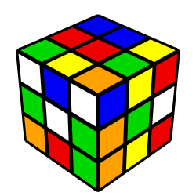

# Click Puzzler



Click Puzzler is a web application created using React.js. It is a single page application where the user must click on DIFFERENT pictures of rubix cubes as the pictures get mixed up after every click.  The application will keep track of the user's highest score while the page remains loaded using React's state management.  

The application is available here:
[Click Puzzler](https://infinite-bayou-45427.herokuapp.com/ "deployed application")

## Downloading the Application

This web application requires React.js, and yarn to run.  If they are installed on your computer, follow these steps:

1. Clone the following repo to your machine

```
git@github.com:zachha/Click-Puzzler.git
```

2. Navigate inside the project and install your package dependencies by typing:

``` 
yarn install
```

3. Use the command line to run the application:

```
yarn start
```

4. If successful, yarn should run the application and automatically open it in your browser.  Check the page out, and get to clicking!

## Libraries and Technologies
* [React.js](https://reactjs.org/ "react.js")
* [Bootstrap 4](https://getbootstrap.com/docs/4.0/getting-started/introduction/ "Bootstrap 4")
* [Heroku](https://dashboard.heroku.com "heroku")

## Things to Come
Here are a few of the things I'm planning on adding to the application:

- green color animation on successful click, red on wrong click

- screen shake on wrong click

- An option to change the pictures shown to something else (such as cats or dogs, etc)
## Contact Info
	
##### **Zach Harmon [Github](https://www.github.com/zachha) - Full-Stack Developer**
##### zachha@gmail.com
